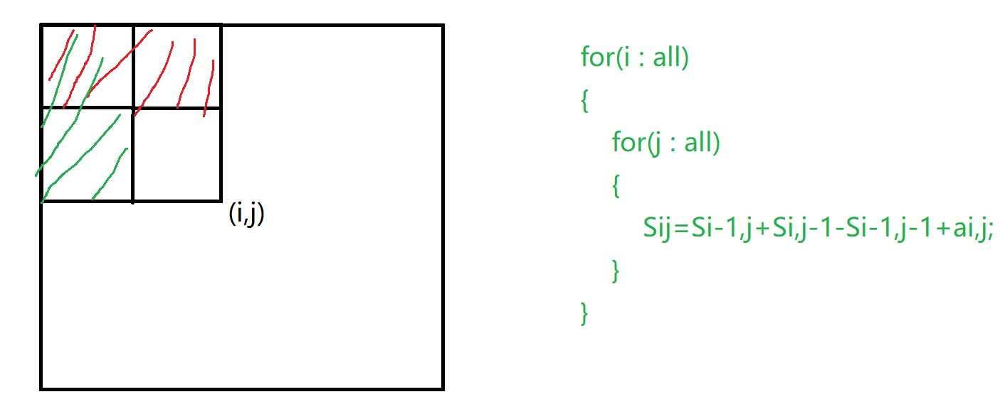

# 前缀和
### 数组元素$a_1,a_2,a_3,...,a_n$，我们定义前缀和为数中前i个元素之和，即$S_i=a_1+a_2+a_3+...+a_i$
## 注意点：下标从1开始，$S_0$我们定义为0
## 作用：如果我们要求从区间[l,r]的和，如果我们一个个的遍历的话时间复杂度就是O(n)，但如果我们有了前缀和之后我们就可以直接利用公式$S_r-S_{l-1}$,时间复杂度就是O(1)了
## 一个小问题，为什么之前表示数组下标要从1开始，而不是从0开始呢？其实这是为了统一格式，因为如果将$S_0$定义为0，那么就可以得到$S_{10}-S_0=S_{10}$，以一个相减的方式去统一处理所有的情况，少一些判断条件。
## 上述就是一维前缀和
### 例题见[前缀和模板题](../../AcWing795.cpp)
# 二维前缀和（子矩阵当中的和）

## 模板：
### $S[i, j] = 第i行j列格子左上部分所有元素的和$
### $以(x_1, y_1)为左上角，(x_2, y_2)为右下角的子矩阵的和为:$
### $S[x_2, y_2] - S[x_1 - 1, y_2] - S[x_2, y_1 - 1] + S[x_1-1, y_1 - 1]$
### 例题见[前缀和模板题](../../AcWing796.cpp)