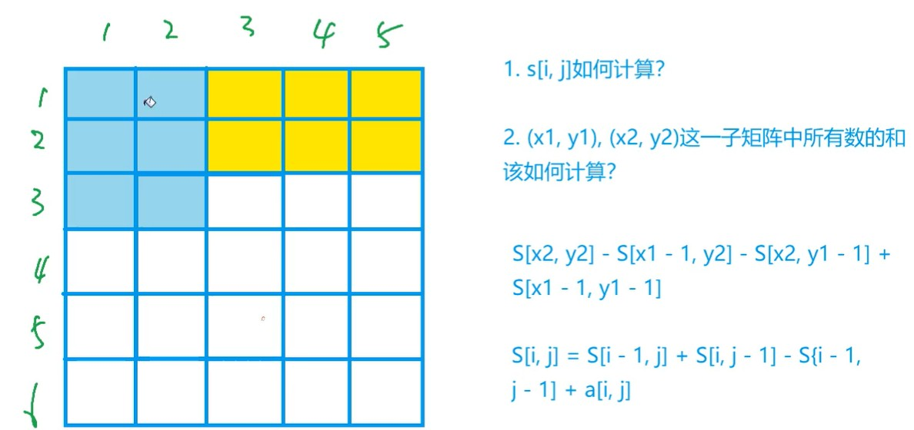

# 差分是前缀和的逆运算
## 一维差分
### 给定数组元素$a_1,a_2,...,a_n$，我们的任务是构造数组$b_1,b_2,...b_n$使得$a_i=b_1+b_2+...+b_i$
### 构造方式：
> $b_1=a_1$
> 
> $b_2=a_2-a_1$
> 
> $b_3=a_3-a_2$
> 
> $b_n=a_n-a_{n-1}$
### 例题见[差分模板题](../../AcWing797.cpp)
### 模板
#### $若要给数组A中区间[l, r]中的每个数加上c：则相当于对B数组进行如下操作：B[l] += c, B[r + 1] -= c（为什么要B[r + 1] -= c？因为A[r+1]及以后不用加上c，所以要去除多余的c)$
## 二维差分
### 给以(x1, y1)为左上角，(x2, y2)为右下角的子矩阵A中的所有元素加上c，相当于对矩阵B进行如下操作：B[x1, y1] += c, B[x2 + 1, y1] -= c, B[x1, y2 + 1] -= c, B[x2 + 1, y2 + 1] += c

### 例题见[差分模板题](../../AcWing798.cpp)