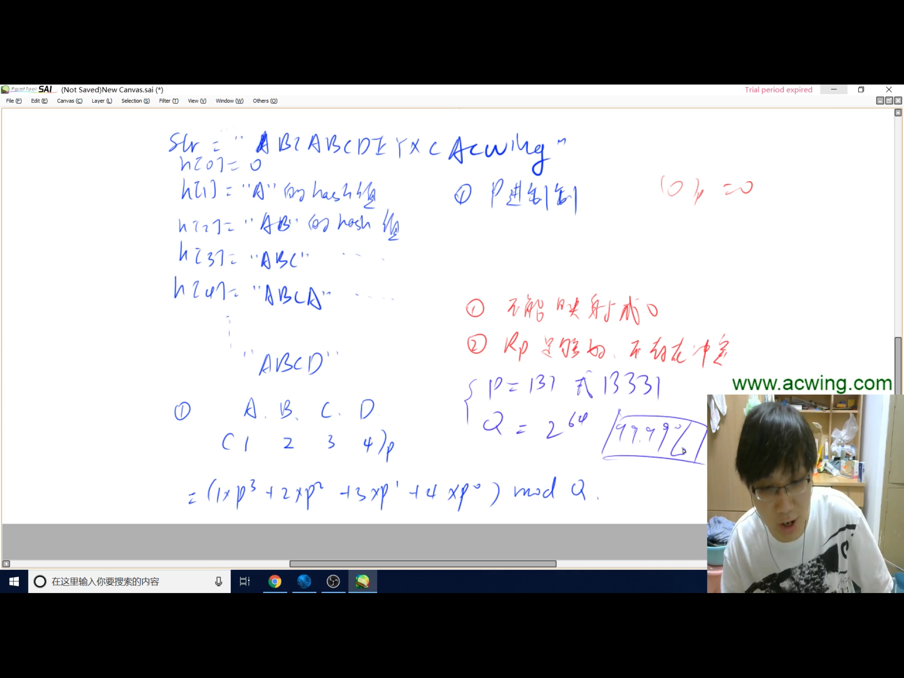

### 哈希表一般不会出删除操作的题目，一般都是做查找和插入操作
## 一、主要作用
> 将一个比较大的数据范围映射到小的数据范围
## 二、存储结构
> 1.开放寻址法：只开了一个一维数组，但数组长度得开到题目当中给的数据范围的2~3倍
> 2.拉链法：如果冲突的话用链表去存储映射值相同的元素
#### [AcWing840](https://www.acwing.com/problem/content/842/)的两种题解：
#### 开放寻址法：
```cpp
#include <iostream>
#include <string.h>
using namespace std;
//为什么要选择0x3f3f3f3f这个数呢？因为这个数在计算机当中非常大，可以认为是无穷大
const int N = 200003, null = 0x3f3f3f3f;
int h[N];
//find函数返回的位置要么是没插入过数要么是已经插入过数x本身
int find(int x)
{
    int k = (x % N + N) % N;
    while(h[k] != null && h[k] != x)
    {
        k ++;
        //不能数组越界
        if(k == N) k = 0;
    }
    return k;
}
int main()
{
    memset(h, 0x3f, sizeof(h));
    int n;
    cin >> n;
    while(n --)
    {
        char op[2];
        int x;
        cin >> op >> x;
        int k = find(x);
        if(op[0] == 'I')
        {
            h[k] = x;
        }
        else
        {
            if(h[k] == x)
            {
                cout << "Yes" << endl;
            }
            else
            {
                cout << "No" << endl;
            }
        }
    }
}
```
#### 拉链法：
```cpp
#include <iostream>
#include <string.h>
using namespace std;
//为什么N要取成100003呢？因为100003是大于100000的第一个质数
const int N = 100003;
/**
 * 采用拉链法
 */
int e[N], ne[N], h[N], idx;
void insert(int x)
{
    int k = (x % N + N) % N;
    e[idx] = x;
    ne[idx] = h[k];
    h[k] = idx ++;
}
bool find(int x)
{
    //这样散列是为了处理负数的问题，因为负数取模结果还是负数
    int k = (x % N + N) % N;
    for (int i = h[k]; i != -1; i = ne[i])
    {
        int u = e[i];
        if (u == x) 
        {
            return true;
        }
    }
    return false;
}
int main()
{
    memset(h, -1, sizeof(h));
    int n;
    cin >> n;
    while (n --)
    {
        char op[2];
        int x;
        cin >> op >> x;
        if (op[0] == 'I')
        {
            insert(x);
        }
        else
        {
            if (find(x))
            {
                cout << "Yes" << endl;
            }
            else
            {
                cout << "No" << endl;
            }
        }
    }
}
```
## 三、字符串的哈希方式

代码详见[代码](../../AcWing841.cpp)