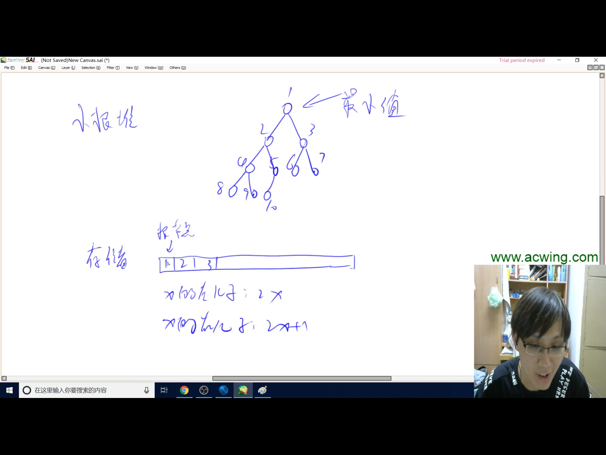

## 如何手写一个堆？
## 堆应该满足的功能：
> 1.插入一个数
> 
> 2.求集合当中的最小值
> 
> 3.删除最小值
>
> 4.删除任意一个元素
>
> 5.修改任意一个元素
### 堆是一棵完全二叉树，分为小根堆和大根堆

### 以上5个操作可以用down操作（下沉）和up操作（上浮）组合完成，也即：
> 1.插入一个数：heap[++size] = x; up()
> 
> 2.求集合当中的最小值：heap[1]
> 
> 3.删除最小值：heap[1] = heap[size]; size--; down()
>
> 4.删除任意一个元素：要么是up要么是down，这两个只会执行一个：heap[k] = heap[size]; size--; down(); up()
>
> 5.修改任意一个元素：要么是up要么是down，这两个只会执行一个：heap[k] = x; down(); up()

