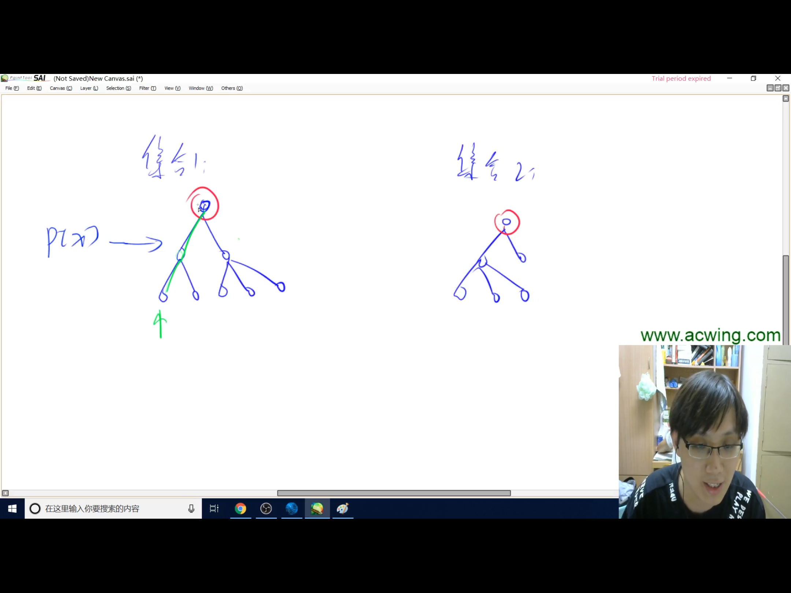

## 并查集

### 两个功能：
> 1.将两个集合合并
> 
> 2.询问两个元素是否在一个集合当中
### 实现方式：
> 每个集合用一个树去存储
>
> 树根的编号就是集合的编号
>
> 每个结点存储它的父结点
>
> 每个结点存储他的父结点，p[x]表示x的父结点
### 问题1：如何判断树根？
> 我们可以设定树根的父节点就是自身，因此可以用if(p[x] == x)来判断是否为树根
### 问题2：如何求x的集合编号？
> while (p[x] != x) x = p[x]
> 因为只有根节点的父节点就是自身，所以一直往上遍历就行了
### 问题3：如何合并两个集合？
> 假设p[x]是x的集合编号，p[y]是y的集合编号，我们直接让p[x] = y就可以了（即将一个集合的根节点的父节点变成另一个集合的根节点）