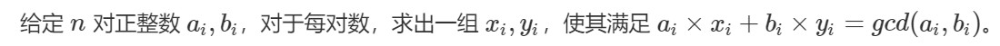

## 题目来源(背板子吧)

```cpp
int exgcd(int a, int b, int &x, int &y)
{
    if(!b)
    {
        x = 1, y = 0;
        return a;
    }
    int d = exgcd(b, a % b, y, x);
    y -= a / b * x;
    return d;
}
```
## [线性同余方程](https://www.acwing.com/problem/content/description/880/)
## 题解见[此处](../../AcWing878.cpp)

## [中国剩余定理](https://www.acwing.com/problem/content/206/)
## 题解见[此处](../../AcWing204.cpp)