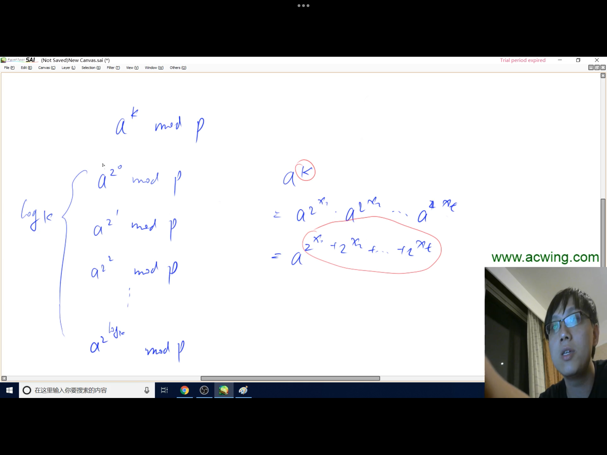

## 一、欧拉函数
### 1.定义：φ(n) = 1~n当中与n互质的数的个数（公因数只有1的两个非零自然数，叫做互质数。所以φ(6)=2，因为1~6当中只有1和5与6互质）
### 2.求法：即先分解质因数再按图中公式求。
## 二、筛法求欧拉函数
### 1.问题引出：求 1∼n中每个数的欧拉函数之和，这样的话我们就得想方法去优化了，不能直接n次for循环，那样太慢了
#### 一个小tips：如果数a是质数，那么a的欧拉函数就是a-1，因为对于质数，他前面的所有数都肯定与它互质，它前面总共a-1个数，因此φ(a) = a-1
### 2.解决方法：线性筛法
```cpp
//Primes[N]数组存放的全是质数
int Primes[N], cnt;
//st[i] = true表示数i不是质数
bool st[N];
int phi[N];
LL getAll(int n)
{
    phi[1] = 1;
    LL res = 1;
    for(int i = 2; i <= n; i ++)
    {
        if(!st[i])
        {
            Primes[cnt ++] = i;
            phi[i] = i - 1;
        }
        for(int j = 0; Primes[j] <= n / i; j++)
        {
            st[Primes[j] * i] = true;
            if (i % Primes[j] == 0)
            {
                phi[Primes[j] * i] = phi[i] * Primes[j];
                break;
            }
            phi[Primes[j] * i] = phi[i] * (Primes[j] - 1);
        }
        res = res + phi[i];
    }
    return res;
}
```
## 三、快速幂
### 1.定义：在logk的时间范围内求出a的k次方模n的值
### 2.求法：先将指数k化成二进制串，写成2的次方之和，再按上图转换计算即可
### 3.代码：
```cpp
LL getQ(int a, int k, int p)
{
    LL res = 1;
    while (k)
    {
        //参考二进制，只有该位为1才需要加
        if (k & 1)
        {
            res = res * a % p;
        }
        //右移
        k = k >> 1;
        //这里也要记得转换为LL，因为a的平方可能会很大
        //不管要不要加（即k的该位是0还是1，我们都往前算a（
        //每次将a去平方），因为：
        //a^2^0 = a
        //a^2^1 = a^2
        //a^2^2 = a^4
        //a^2^3 = a^8
        //a^2^4 = a^16
        //a^2^5 = a^32
        a = (LL)a * a % p;
    }
    return res;
}
```
## 四、快速幂求逆元

### 即a除以b与a乘以x模m同余
### 代码：直接套用上述getQ()函数，只不过输入的k换成p - 2，然后根据题目条件特判，详见[该题](../../AcWing876.cpp)