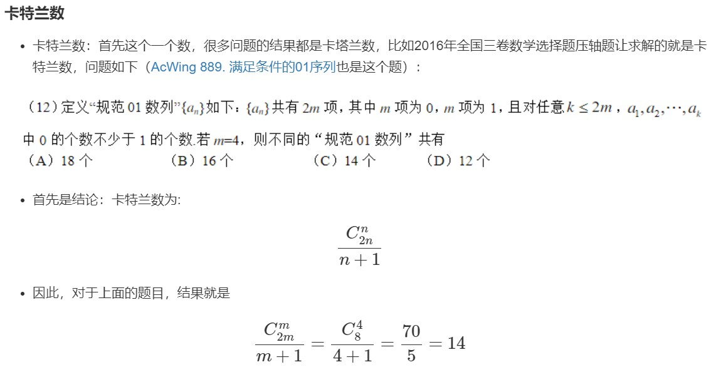

## 一、题型1

### 解法：利用公式$C_a^b=C_{a-1}^b+C_{a-1}^{b-1}$求出所有的C，用数组存着，然后再取进行计算
```cpp
const int N = 2010, mod = 1e9 + 7;
int c[N][N];
void init()
{
    for(int i = 0; i < N; i++)
    {
        for(int j = 0; j <= i; j++)
        {
            if (!j)
            {
                c[i][j] = 1;
            }
            else
            {
                c[i][j] = (c[i - 1][j - 1] + c[i - 1][j]) % mod;
            }
        }
    }
}
```
## 二、题型2
见[题解](../..//AcWing886.cpp)
## 三、题型3
### 利用Lucas定理：$C_a^b与C_{a mod p}^{b mod p}·C_{a/p}^{b/p}模p同余$
见[题解](../..//AcWing887.cpp)
## 四、题型4
### 进行高精度乘法
见[题解](../..//AcWing888.cpp)
## 五、卡特兰数
