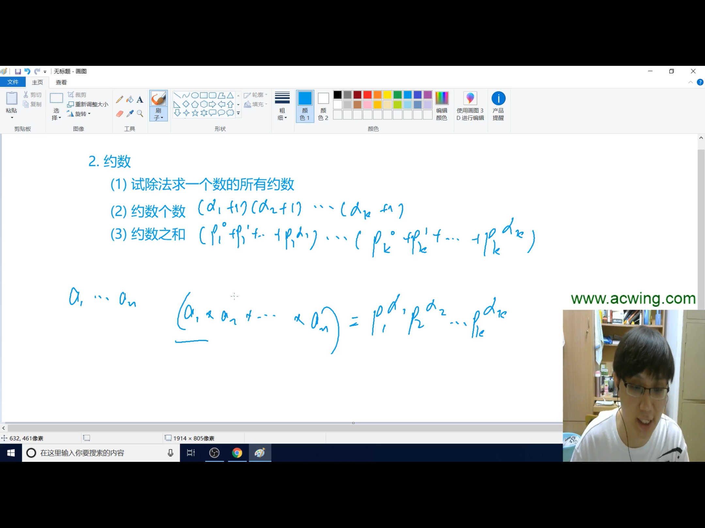

## 一、质数（也叫素数）
### 质数是针对大于1的自然数定义的，小于等于1的都不是质数
## 1.质数的判定
```cpp
bool isPrime(int x)
{
    if(x < 2) return false;
    //判断条件最好不用写成i * i <= n，因为存在溢出风险
    for(int i = 2; i <= x / i; i++)
    {
        if(x % i == 0) return false;
    }
    return true;
}
```
## 2.分解质因数
输出每个质因数的底数和出现的次数（即指数）
```cpp
void divide(int x)
{
    for(int i = 2; i <= x / i; i++)
    {
        //不用判断i是不是质数，原因自己想想就明白了
        if(x % i == 0)
        {
            int s = 0;
            while(x % i == 0)
            {
                x /= i;
                s++;
            }
            cout<<i<<" "<<s<<endl;
        }
    }
    if(x > 1)
    {
        cout<<x<<" "<<1<<endl;
    }
}
```
## 3.筛质数
### 朴素法
```cpp
bool st[N];
int Primes[N], cnt;
void getPrimes(int n)
{
    for(int i = 2; i <= n; i++)
    {
        if (!st[i]) 
        {
            Primes[cnt++] = i;
            for (int j = i + i; j <= n; j += i) 
            {
                st[j] = true;
            }
        }
    }
}
```
### 线性筛法
```cpp
bool st[N];
int Primes[N], cnt;
void getPrimes(int n)
{
    for(int i = 2; i <= n; i++)
    {
        if (!st[i]) 
        {
            Primes[cnt++] = i;
        }
        //与朴素法不同，线性筛法这一层循环应
        //放在if (!st[i]) 同级
        for (int j = 0; Primes[j] <= n / i; j ++) 
        {
            st[i * Primes[j]] = true;
            if (i % Primes[j] == 0)
            {
                break;
            }
        }
    }
}
```
## 二、约数
## 1.试除法求一个数的所有约数
```cpp
vector<int> getDivisors(int n)
{
    vector<int> res;
    for(int i = 1; i <= n / i; i ++)
    {
        if(n % i == 0) 
        {
            res.push_back(i);
            if(i != n / i) res.push_back(n / i);
        }
    }
    sort(res.begin(), res.end());
    return res;
}
```

## 2.求约数个数
### 如上图所示，将所求的数转换为以每个质数为底的幂的乘积
### 那么结果就是所有幂指数+1的乘积
```cpp
unordered_map<int, int> m;
int x;
cin >> x;
//将x转换为以每个质数为底的幂的乘积
for(int i = 2; i <= x / i; i++)
{
    while (x % i == 0)
    {
        x /= i;
        m[i] ++;
    }
}
//千万别忘记这一步，将最后一个质数也得计数
if (x > 1)
{
    m[x] ++;
}
//求结果
LL ans = 1;
for (auto t : m)  
{
    ans = ans * (t.second + 1);
}
```
## 3.求约数之和
```cpp
int x;
cin >> x;
unordered_map<int, int> m;
//这里千万不要把x和n写混了，有时候写着写着就容易把
//x写成n，这样的话必定WA!!!
for (int i = 2; i <= x / i; i++)
{
    while (x % i == 0)
    {
        x /= i;
        m[i] ++;
    }
}
if (x > 1)
{
    m[x] ++;
}
LL ans = 1;
for (auto t : m)
{
    int p = t.first, a = t.second;
    LL ans_loc = 1;
    while (a --)
    {
        ans_loc = (ans_loc * p + 1) % mod;
    }
    ans = ans * ans_loc % mod;
}
cout << ans << endl;
```
## 4.最大公约数（辗转相除法）
```cpp
int gcd(int a, int b)
{
    return b ? gcd(b, a % b) : a;
}
```