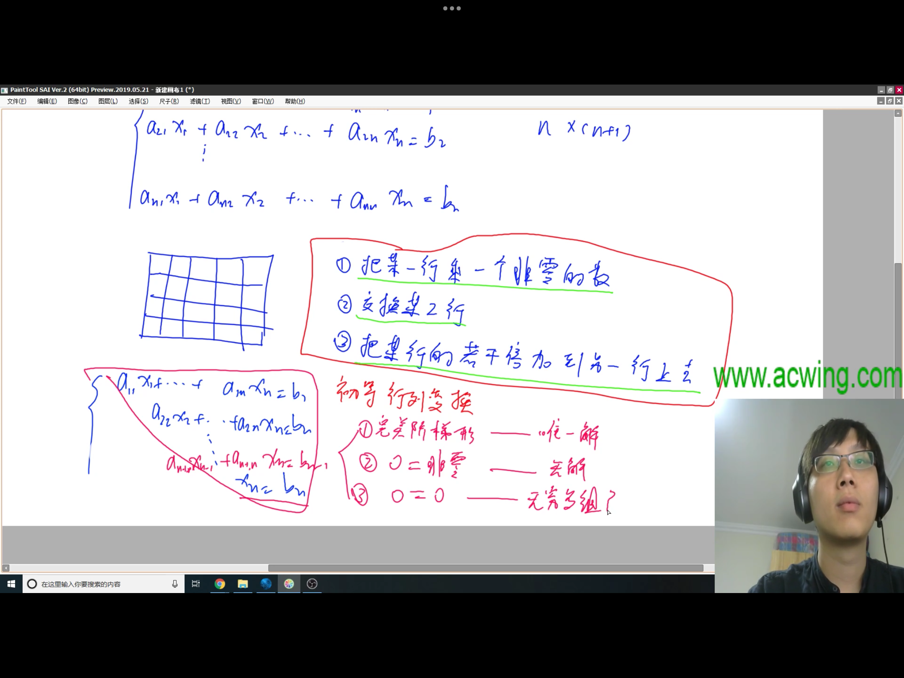

## 一、高斯消元解线性方程组
### 要解决的问题：比方说求解方程组
### 采用线性代数当中的初等行变换进行的

```cpp
const int N = 110;
//eps别手欠定义成int了
double eps = 1e-6;
int n;
//a数组也得定义成double类型
double a[N][N];
int gauss()
{
    //c代表列，r代表行
    int c, r;
    for (c = 0, r = 0; c < n; c++)
    {
        int t = r;
        //找出第c列绝对值最大元素所在行
        for(int i = r; i < n; i++)
        {
            if (fabs(a[i][c]) > fabs(a[t][c]))
            {
                t = i;
            }
        }
        //如果第c列绝对值最大元素为0，那也就没必要找了
        if(fabs(a[t][c]) < eps)
        {
            continue;
        }
        //交换
        for (int i = c; i <= n; i++)
        {
            swap(a[t][i], a[r][i]);
        }
        //除
        for (int i = n; i >= c; i--)
        {
            a[r][i] /= a[r][c];
        }
        for (int i = r + 1; i < n; i++)
        {
            if (fabs(a[i][c]) > eps)
            {
                for (int j = n; j >= c; j--)
                {
                    a[i][j] -= a[i][c] * a[r][j];
                }
            }
        }
        r ++;
    }
    if (r < n)
    {
        for (int i = r; i < n; i++)
        {
            if (fabs(a[i][n]) > eps)
            {
                //无解
                return 0;
            }
        }
        //有无穷多组解
        return 2;
    }
    for (int i = n - 1; i >= 0 ; i--)
    {
        for (int j = i + 1; j < n; j++)
        {
            a[i][n] -= a[j][n] * a[i][j];
        }
    }
    //有唯一解
    return 1;
}
```
## 二、高斯消元解异或线性方程组
```cpp
const int N = 110;
int a[N][N], n;
int gauss()
{
    int c, r;
    for(c = 0, r = 0; c < n; c++) 
    {
        int t = -1;
        for (int i = r; i < n; i++)
        {
            if (a[i][c])
            {
                t = i;
                break;
            }
        }
        if (t == -1)
        {
            continue;
        }
        for (int i = n; i >= c; i--)
        {
            swap(a[t][i], a[r][i]);
        }
        //异或对这题没有对应的除的步骤
        // for (int i = n; i >= c; i--)
        // {
        //     a[t][i] ^= a[c][i];
        // }
        for (int i = r + 1; i < n; i++)
        {
            if(a[i][c])
            {
                for (int j = n; j >= c; j--)
                {
                    a[i][j] ^= a[r][j];
                }
            }
        }
        r ++;
    }
    if(r < n)
    {
        for (int i = r; i < n; i++)
        {
            if (a[i][n])
            {
                return 0;
            }
        }
        return 2;
    }
    for (int i = n - 1; i >= 0; i--)
    {
        for(int j = i + 1; j <= n; j++)
        {
            if(a[i][j])
            {
                a[i][n] ^= a[j][n];
            }
        }
    }
    return 1;
}
```