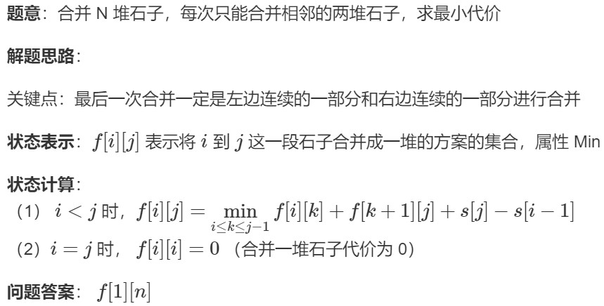
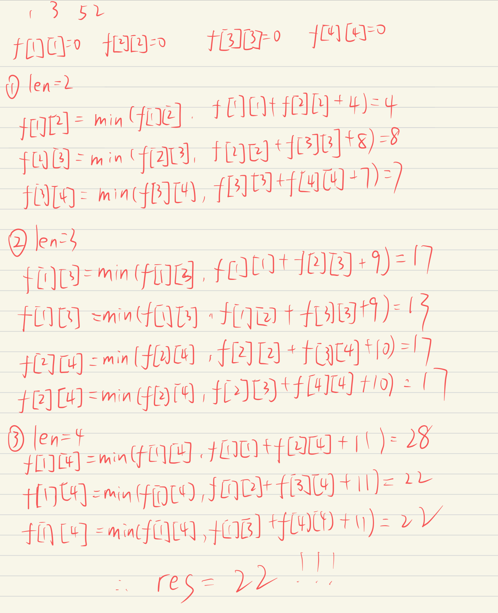

## [石子合并](https://www.acwing.com/problem/content/284/)

## 代码：
```cpp
int f[N][N];
int s[N];
int main()
{
    int n;
    cin >> n;
    for (int i = 1; i <= n; i++)
    {
        cin >> s[i];
    }
    for (int i = 1; i <= n; i++)
    {
        s[i] += s[i-1];
    }
    //将f数组的初始值初始为无穷大
    memset(f, 0x3f, sizeof(f));
    for (int len = 1; len <= n; len++)
    {
        for (int i = 1; i + len - 1 <= n; i++)
        {
            int j = i + len - 1;
            //因为合并同一堆石子的实际意义是0
            if (len == 1)
            {
                f[i][j] = 0;
            }
            for (int k = i; k < j; k++)
            {
                f[i][j] = min(f[i][j], f[i][k] + f[k + 1][j] + s[j] - s[i - 1]);
            }
        }
    }
    cout << f[1][n];
}
```
## 假设输入为1，3，5，2，则计算过程如下：
