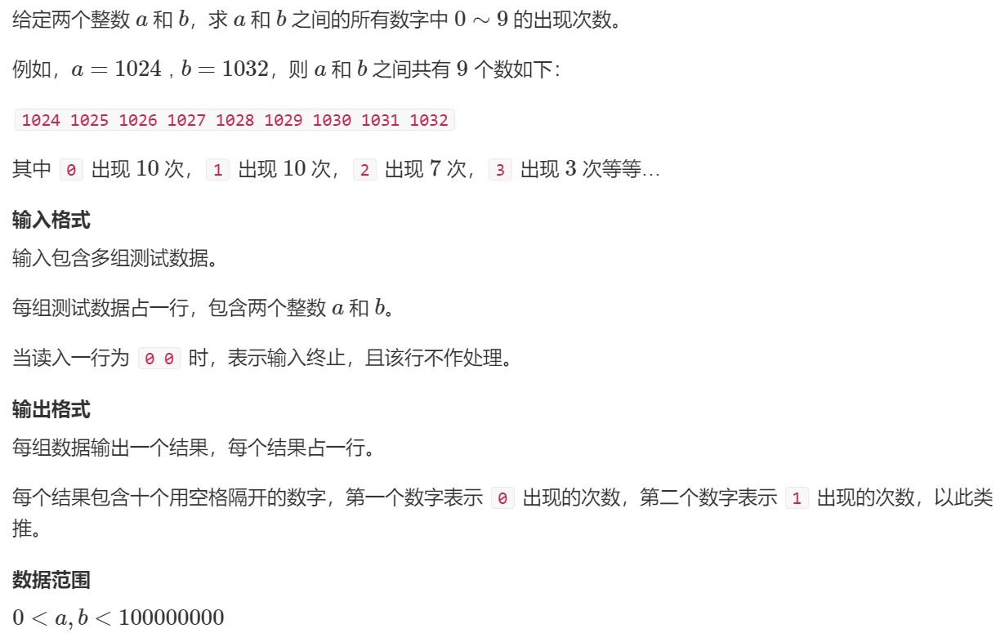

## 计数问题

### 思路：[利用前缀和的思想，分别求出1~a和1~b当中x出现的次数，记为count(a, x)、count(b, x)。那a~b当中x出现的次数即为：count(b, x) - count(a - 1, x)](https://www.acwing.com/solution/content/5623/)
```cpp
#include <iostream>
using namespace std;
const int N = 1e+8;
int num[N];
int power10(int i) //返回10的i次方
{
    int ans = 1;
    while(i--)
    {
        ans *= 10;
    }
    return ans;
}
int get_num(int l, int r) //返回num数组当中从l到r的数的大小
{
    int ans = 0;
    for(int i = r; i >= l; i--)
    {
        ans = ans * 10 + num[i];
    }
    return ans;
}
int count(int n, int x)
{
    //将数n记录到数组num当中去
    int len = 0, ans = 0;
    while(n)
    {
        num[++len] = n % 10;
        n /= 10;
    }
    if(x != 0)
    {
        for (int i = len; i > 0; i--)
        {
            //如果i == len的话，就直接考虑取abc的等价情况就行
            //否则会造成冗余
            if (i < len)
            {
                //取0~(abc-1)
                ans += get_num(i + 1, len) * power10(i - 1);
            }
            //取abc
            if (x == num[i])
            {
                ans += (get_num(1, i - 1) + 1);
            }
            else if (x < num[i])
            {
                ans += power10(i - 1);
            }
            else ans += 0;
        }
    }
    else
    {
        //x == 0 时，不能放在首位
        for (int i = len - 1; i > 0; i--)
        {
            //因为此时i是从len - 1开始，所以也就不用像x != 0
            //那样先特判一下
            //注意这里是get_num(i + 1, len) - 1
            //因为只能取001~(abc-1)，而x != 0时则
            //可以取000~(abc-1)，要多一个
            ans += (get_num(i + 1, len) - 1) * power10(i - 1);
            //取abc，以下代码与x != 0时完全相同
            if (x == num[i])
            {
                ans += (get_num(1, i - 1) + 1);
            }
            else if (x < num[i])
            {
                ans += power10(i - 1);
            }
            else ans += 0;
        }
    }
    return ans;
}
int main()
{
    int a, b;
    while (cin >> a >> b, a || b)
    {
        if (a > b)
        {
            swap(a, b);
        }
        for(int i = 0; i < 10; i++) {
            int ans = count(b, i) - count(a - 1, i);
            cout << ans << " ";
        }
        cout << endl;
    }
}
```