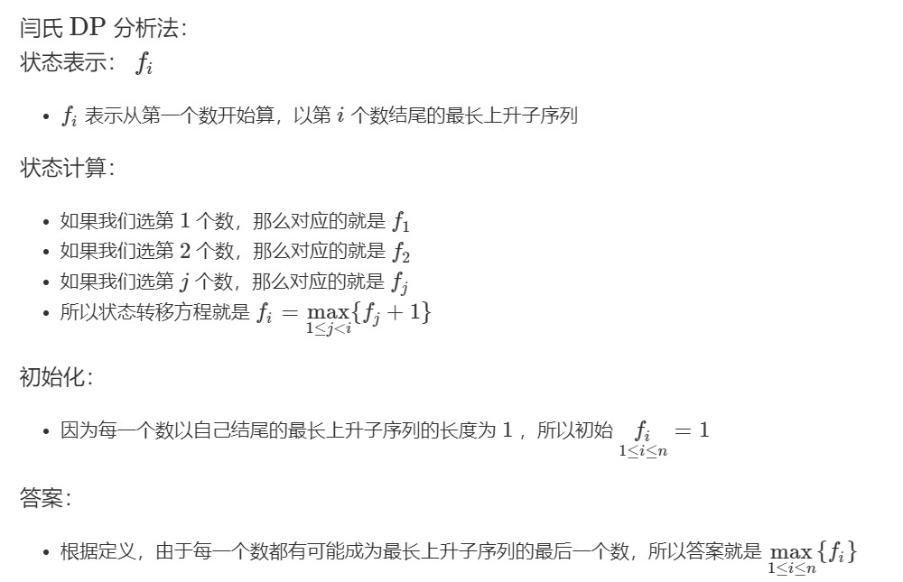

## [一、数字三角形](https://www.acwing.com/activity/content/problem/content/1002/)

### [代码](../../AcWing898.cpp)
## [二、最长上升子序列Ⅰ](https://www.acwing.com/activity/content/problem/content/1003/)

### [代码](../../AcWing895.cpp)
## [三、最长上升子序列Ⅱ](https://www.acwing.com/activity/content/problem/content/1004/)

### [代码](../../AcWing896.cpp)
## [四、最长公共子序列](https://www.acwing.com/activity/content/problem/content/1005/)

### [代码](../../AcWing897.cpp)
## [五、最短编辑距离](https://www.acwing.com/problem/content/904/)

### [代码](../../AcWing902.cpp)
## [六、编辑距离](https://www.acwing.com/problem/content/901/)
### 跟“最短编辑距离”思路一样，只不过有多组输入
### [代码](../../AcWing899.cpp)