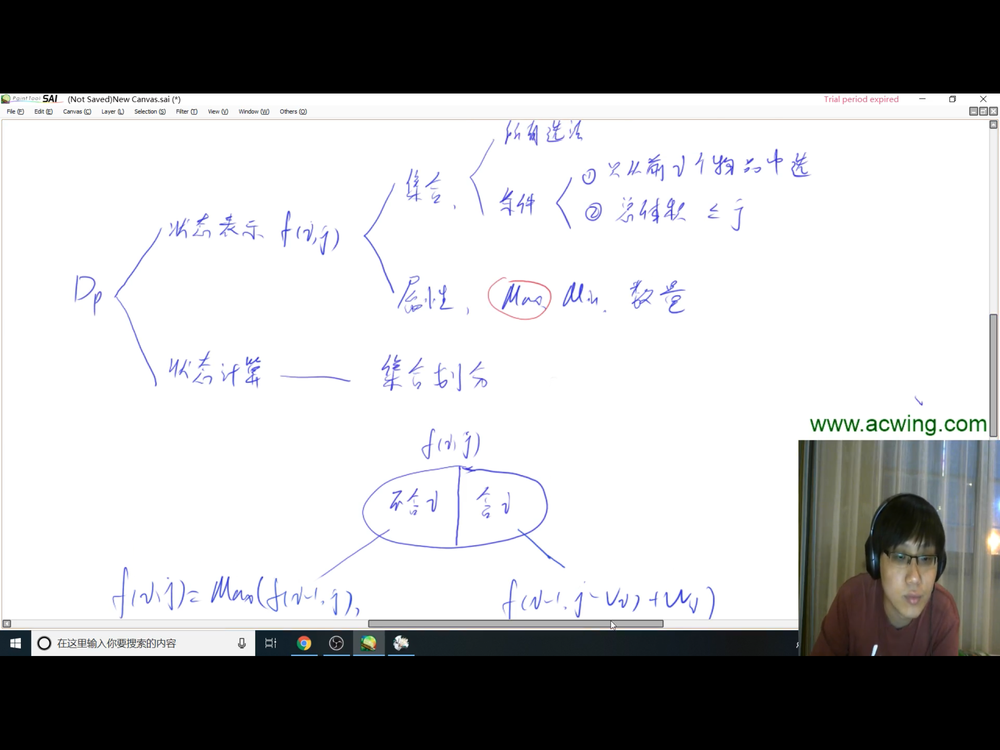
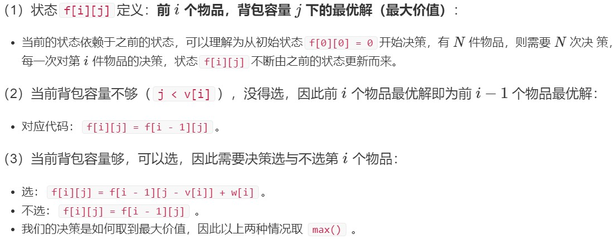
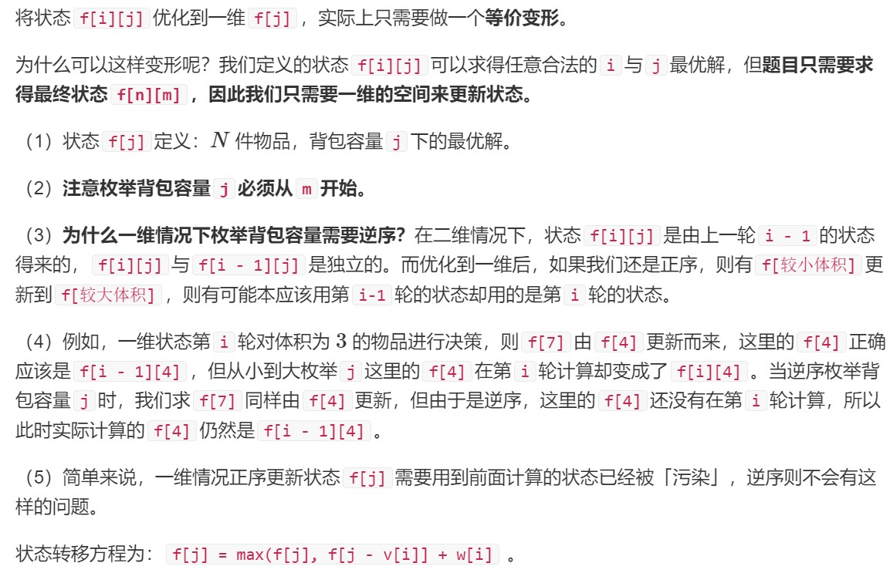
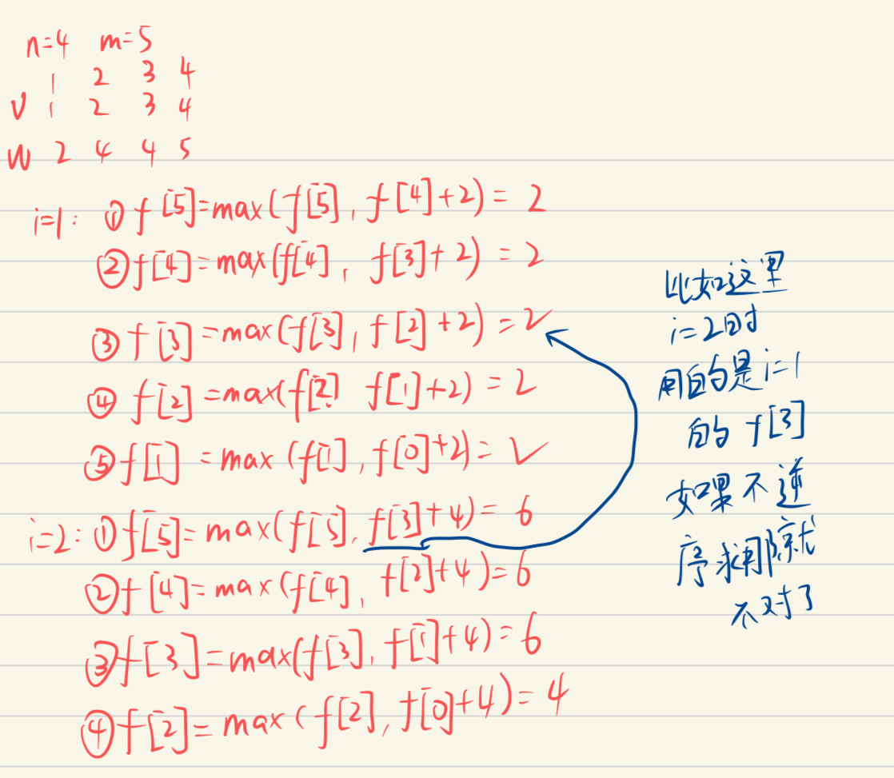
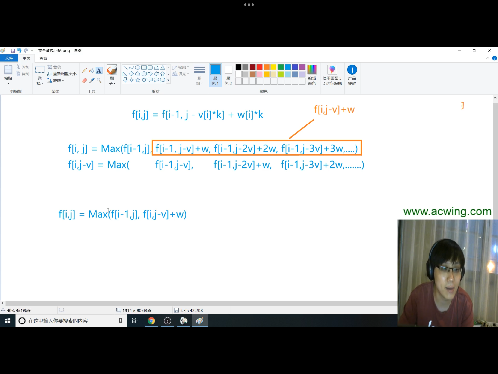

# 注意：背包问题不一定要求装满背包

## 一、01背包问题
### 每件物品最多用一次
#### 1.二维无优化版本

```cpp
int v[N], w[N];
int f[N][N];
int n, m;
cin >> n >> m;
for (int i = 1; i <= n; i++)
{
    cin >> v[i] >> w[i];
}
for (int i = 1; i <= n; i++)
{
    for (int j = 0; j <= m; j++)
    {
        if (j < v[i])
        {
            f[i][j] = f[i - 1][j];
        }
        else
        {
            f[i][j] = max(f[i - 1][j], f[i - 1][j -v[i]] + w[i]);
        }
    }
}
cout << f[n][m] << endl;
```
#### 2.一维版本

#### 为什么非得逆序？见下图：

```cpp
int v[N], w[N];
int f[N];
int main()
{
    int n, m;
    cin >> n >> m;
    for (int i = 1; i <= n; i++)
    {
        cin >> v[i] >> w[i];
    }
    for (int i = 1; i <= n; i++)
    {
        for(int j = m; j >= v[i]; j--)
        {
            f[j] = max(f[j], f[j - v[i]] + w[i]);
        }
    }
    cout << f[m] << endl;
}
```
## 二、完全背包问题
### 每件物品可以用无限次
### 首先看暴力版本：很明显O(n^3)超时了
```cpp
int v[N], w[N];
int f[N][N];
int main()
{
    int n, m;
    cin >> n >> m;
    for (int i = 1; i <= n; i++)
    {
        cin >> v[i] >> w[i];
    }
    for (int i = 1; i <= n; i++)
    {
        for (int j = 0; j <= m; j++)
        {
            for (int k = 0; k * v[i] <= j; k++)
            {
                //k = 0时就是f[i][j] = max(f[i][j], f[i - 1][j])，k不为0时就是在k 内部进行比较
                f[i][j] = max(f[i][j], f[i - 1][j - k * v[i]] + k * w[i]);
            }
        }
    }
    cout << f[n][m] << endl;
}
```
### 优化思路（变成了O(n^2)）：

### 代码：
```cpp
int v[N], w[N];
int f[N][N];
int main()
{
    int n, m;
    cin >> n >> m;
    for (int i = 1; i <= n; i++)
    {
        cin >> v[i] >> w[i];
    }
    for (int i = 1; i <= n; i++)
    {
        for (int j = 0; j <= m; j++)
        {
            if (j >= v[i])
            {
                //可以看到，完全背包与01背包仅在此处不同
                //01背包是f[i][j] = max(f[i - 1][j], f[i - 1][j - v[i]] + w[i]);因此转化为1维时
                //也不需要逆序进行了(不要想着从实际角度去理解，因为推导出来就是这样的)
                f[i][j] = max(f[i - 1][j], f[i][j - v[i]] + w[i]);
            }
            else
            {
                f[i][j] = f[i - 1][j];
            }
        }
    }
    cout << f[n][m] << endl;
}
```
### 一维优化代码：
```cpp
int v[N], w[N];
int f[N];
int main()
{
    int n, m;
    cin >> n >> m;
    for (int i = 1; i <= n; i++)
    {
        cin >> v[i] >> w[i];
    }
    for (int i = 1; i <= n; i++)
    {
        //与01背包的区别是不用逆序了
        for (int j = v[i]; j <= m; j++)
        {
            f[j] = max(f[j], f[j - v[i]] + w[i]);
        }
    }
    cout << f[m] << endl;
}
```
## 三、多重背包问题
### 每件物品的个数不一样
### 暴力代码：
```cpp
int v[N], w[N], s[N];
int f[N][N];
int main()
{
    int n, m;
    cin >> n >> m;
    for (int i = 1; i <= n; i++)
    {
        cin >> v[i] >> w[i] >> s[i];
    }
    for (int i = 1; i <= n; i++)
    {
        for (int j = 0; j <= m; j++)
        {
            for (int k = 0; k <= s[i] && k * v[i] <= j ; k++)
            {
                f[i][j] = max(f[i][j], 
                f[i - 1][j - k * v[i]] + k * w[i]);
            }
        }
    }
    cout << f[n][m];
}
```
### 优化思路：
```cpp
int w[N], v[N];
int f[N];
int cnt;
int main()
{
    int n, m;
    cin >> n >> m;
    for (int i = 1; i <= n; i++)
    {
        int a, b, s, k = 1;
        cin >> a >> b >> s;
        while (k <= s)
        {
            cnt ++;
            v[cnt] = k * a;
            w[cnt] = k * b;
            s -= k;
            k *= 2;
        }
        if(s > 0)
        {
            cnt ++;
            v[cnt] = s * a;
            w[cnt] = s * b;
        }
    }
    n = cnt;
    for (int i = 1; i <= n; i++)
    {
        for(int j = m; j >= v[i]; j--)
        {
            f[j] = max(f[j], f[j - v[i]] + w[i]);
        }
    }
    cout << f[m];
}
```
## 四、分组背包问题
### 物品是n组，每组物品当中有若干个，从第i组物品选哪个，或者不选
```cpp
const int N = 110;
int v[N][N], w[N][N];
int s[N];
int f[N];
int main()
{
    int n, m;
    cin >> n >> m;
    for (int i = 1; i <= n; i++)
    {
        cin >> s[i];
        for (int j = 1; j <= s[i]; j++)
        {
            cin >> v[i][j] >> w[i][j];
        }
    }
    for (int i = 1; i <= n; i++)
    {
        for (int j = m; j > 0; j--)
        {
            for (int k = 1; k <= s[i]; k++)
            {
                if(j >= v[i][k])
                {
                    f[j] = max(f[j], f[j - v[i][k]] + w[i][k]);
                }
            }
            
        }
        
    }
    cout << f[m];
}
```