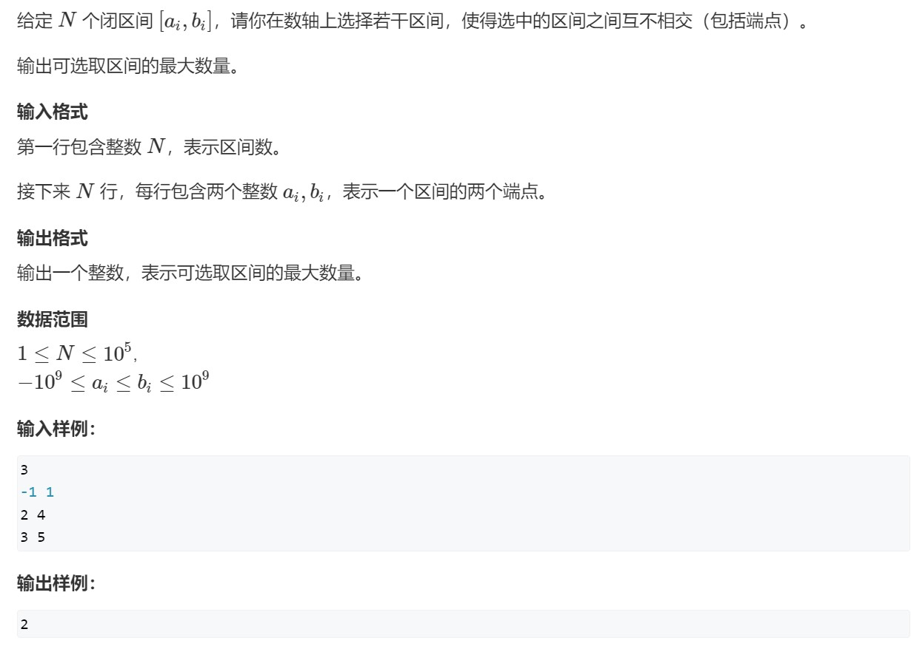

## 一、区间选点

### 思路：1.将每个区间按**右端点**从小到大排序；2.从前往后依次枚举每个区间；如果当前区间已包含点，则略过，否则选择当前区间的右端点
## 二、最大不相交区间数量

### 思路和上题一模一样
## 三、区间分组

### 思路：1.将所有区间按**左端点**从小到大排序；2.从前往后处理每个区间，判断能否将其放到某个现有的组当中：如果不存在这样的组，则开新组，然后将其放进去；如果存在这样的组，则将其放进去，并更新组的max_r
### 为什么不能按左端点排序？参考[这里](https://www.acwing.com/problem/content/discussion/content/5141/)
## 四、区间覆盖

### 思路：1.将所有区间按**左端点**从小到大排序；2.从前往后枚举每个区间，在所有能覆盖start的区间当中，选择右端点最大的区间，然后将start更新成右端点的最大值
